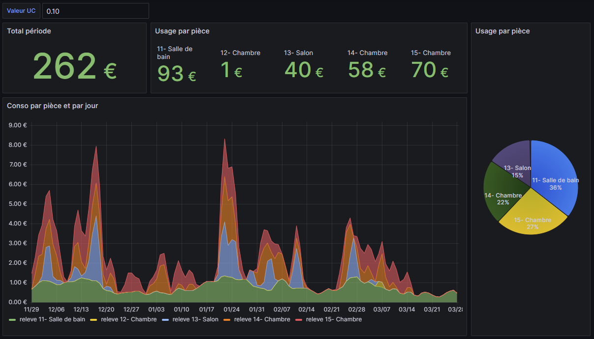

# ista-webconsofr
Grab data from ISTA webconso.fr website

Stores data in a sqlite database.

Usage: 
```
pip install -r requirements.txt
python3 scraping.py
```
* Will create a sqlite database if it does not exist.
* Will check last data in database and grab data from this date to today.

This repository also provides Grafana dashboard compatible with the implementation.
To launch on localhost:
```
docker compose up -d
# crawl to http://localhost:3000
```

Config file
-----------

Create a `configuration.yaml` file with the following content:
```
ista_webconso:
  login: "xxx@xxx.fr"
  pwd: "xxxxxxx"

# where is your home ? to get weather temperature history.
location:
  latitude: 48.8939
  longitude: 2.2886
```

Overview
---------


